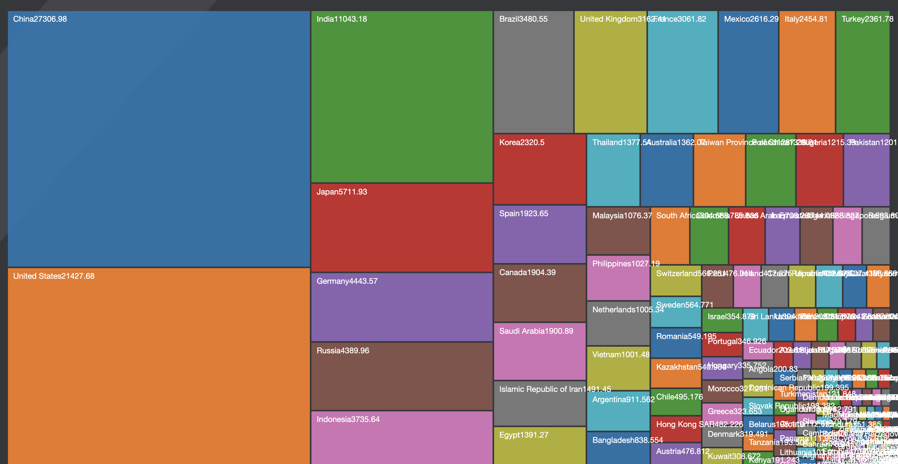
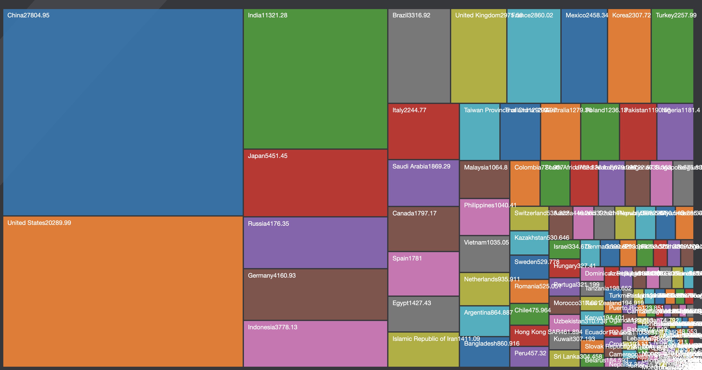

covid-industries gist
================
Yanqi Xu
2020-05-06 01:12:57

  - [Google Mobility](#google-mobility)
  - [航班](#航班)
  - [旅游](#旅游)
  - [股市](#股市)
  - [Medical Trials](#medical-trials)
  - [World Economy](#world-economy)
  - [油价](#油价)
  - [失业人数](#失业人数)

``` r
library(tidyverse)
library(scales)
library(janitor)
library(fs)
library(readxl)
```

这些都是用于sketch的草图。是由R生成的，与网页中用D3画出来的动态图不一样。但可以用于作为写作用的依据。代码部分忽略就好。

## Google Mobility

``` r
mob_url <- "https://www.gstatic.com/covid19/mobility/Global_Mobility_Report.csv?cachebust=911a386b6c9c230f"

mob <- read_csv(mob_url,
                col_types = cols(sub_region_2 = col_character()))

select_countries <- c(
  "United States",
  "Italy",
  "France",
  "Germany",
  "Spain",
  "Kenya",
  "South Africa",
  "United Kingdom",
  "Singapore",
  "South Korea",
  "Japan",
  "Indonesia",
  "Australia",
  "Brazil",
  "Colombia",
  "Iran",
  "Egypt")

mob <- mob %>% 
  filter(country_region %in% select_countries & is.na(sub_region_1))

mob %>% 
  ggplot(aes(x = date, y = retail_and_recreation_percent_change_from_baseline)) +
  facet_wrap(~country_region) +
  geom_line() + 
  theme_minimal()
```

<!-- -->

``` r

#mob %>% 
 # rename(perc = retail_and_recreation_percent_change_from_baseline) %>% 
  #select(country_region, date, perc) %>% 
#write_csv(path = path(here::here(),"industries/website/data/mobility.csv"),na = "")
```

## 航班

[最新数据](https://www.iata.org/en/iata-repository/publications/economic-reports/air-passenger-monthly-analysis---mar-2020/)，就把图5(国际)和图7（国内）的内容画出来

## 旅游

旅游的数据其实不太好，大多数只到2月。看看要不要保留或者再找找别的数据。

## 股市

线图，straightforward.
和[这个](https://www.macrotrends.net/1358/dow-jones-industrial-average-last-10-years)拉到最近六月看一样。看看3.23这天发生了什么，对各国经济反应影响怎么样。

## Medical Trials

International Clinical Trials Registry Platform (ICTRP)

``` r
who_url <- "https://www.who.int/ictrp/COVID19-web.csv"

trials <- read_csv(who_url, col_types = cols(.default = col_character())) %>% clean_names()

trials <- trials %>% mutate(scbk = 
                                                   case_when(
                                                     countries == "China" ~ "中国",
                                                     countries == "United States" ~ "美国",
                                                     countries == "Iran (Islamic Republic of)" ~ "伊朗",
                                                     countries == "France" ~ "法国",
                                                     countries == "Spain" ~ "西班牙",
                                                     countries == "Germany" ~ "德国",
                                                     countries == "Iran (Islamic Republic of)" ~ "伊朗",
                                                     countries == "United Kingdom" ~ "英国",
                                                     countries == "Italy" ~ "意大利",
                                                     countries == "Australia" ~ "澳大利亚",
                                                     TRUE ~ "其他"
                                                   ))


  
trials_count <- trials %>% count(scbk) 

  #write_csv(path = path(here::here(),"industries/website/data/trials.csv"),na = "")

#d3_nest(trials_count, root = "Country", value_cols = c("n")) %>% #write(path(here::here(),"industries/website/data/trials.json"))
```

| scbk |   n |
| :--- | --: |
| 中国   | 707 |
| 伊朗   |  89 |
| 其他   | 691 |
| 德国   |  70 |
| 意大利  |  50 |
| 法国   | 177 |
| 澳大利亚 |  27 |
| 美国   | 193 |
| 英国   |  34 |
| 西班牙  |  80 |

## World Economy

网站的草图在这里。要调。字挤在一团是但还没来得及弄，到时是会动的。可以看到美国等发达国家有些是负增长。
 

``` r
IMF_WEO_Data <- read_csv("industries/data/IMF_WEO_Data.csv")

IMF_WEO_Data <- IMF_WEO_Data %>% clean_names()

imf <- IMF_WEO_Data %>% 
  select(c(country,contains("x20"))) %>% 
  mutate_at(.vars = vars(contains("x20")), .funs = list(~as.numeric(str_remove(.,","))))


imf <- imf %>% 
  mutate(sc = case_when(
                                                     countries == "China" ~ "中国",
                                                     countries == "United States" ~ "美国",
                                                     countries == "India" ~ "印度",
                                                     countries == "France" ~ "法国",
                                                     countries == "Brazil" ~ "巴西",
                                                     countries == "Germany" ~ "德国",
                                                     countries == "Japan" ~ "日本",
                                                     countries == "United Kingdom" ~ "英国",
                                                     countries == "Russia" ~ "俄罗斯",
                                                     countries == "Indonesia" ~"印度尼西亚",
                                                     TRUE ~ "其他"
                                                   ))
#imf %>% write_csv("industries/data/imf_ppp.csv")


imf %>% 
  mutate(parent = "country") %>% 
  filter(country != "Syria"& country !="Venezuela") %>% 
  write_csv(path = path(here::here(),"industries/website/data/imf_ppp.csv"),na = "")
```

## 油价

就类似[这张图](https://markets.businessinsider.com/commodities/oil-price?type=wti)
时间线调到6个月以内，重点要写写4.20这天发生了什么

## 失业人数

这个也比较简单，对照文档里内容写就可以。
